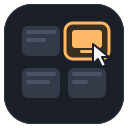
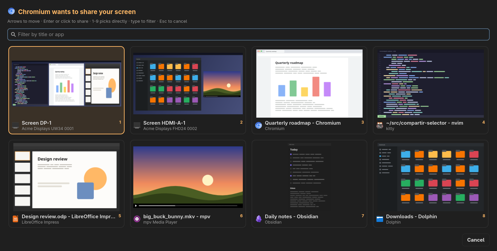

<div align="center">



# wlr-share-picker

**The screen-sharing picker `xdg-desktop-portal-wlr` never had: live thumbnails of every monitor and window.**

[](https://github.com/fire-fox/wlr-share-picker/actions/workflows/ci.yml)
[](https://github.com/fire-fox/wlr-share-picker/actions/workflows/codeql.yml)
[](https://scorecard.dev/viewer/?uri=github.com/fire-fox/wlr-share-picker)
[](https://github.com/fire-fox/wlr-share-picker/releases/latest)
[](LICENSE)

[](https://www.python.org/)
[](https://www.gtk.org/)
[](https://gitlab.freedesktop.org/wlroots/wlroots)
[](https://github.com/emersion/xdg-desktop-portal-wlr)
[](https://github.com/fire-fox/wlr-share-picker/releases/latest)

[Features](#features) · [Install](#install) · [Configuration](#configuration-file) · [Security](SECURITY.md) · [Contributing](CONTRIBUTING.md) · [Changelog](CHANGELOG.md)

</div>


<sub>Illustrative screenshot: the windows are invented and drawn by `scripts/demo-screenshot.py`.</sub>

When an app asks to share the screen, the wlr portal has no picker of its own: it runs an external program and
expects one line back. This one shows a grid with a live thumbnail, icon and title of every monitor and window, and
returns the chosen source. It works with the wlroots compositors that use `xdg-desktop-portal-wlr` (mango, sway,
river…); GNOME, KDE, Hyprland and niri have portals and pickers of their own.

## Features
1. **Thumbnail grid** of every monitor and window the portal offers, captured with `grim`, with the app's icon and
   name taken from its `.desktop` file.
2. **Live thumbnails and titles**: re-captured every `refresh_seconds` while the picker is open.
3. **Keyboard first**: arrows/Tab to move (the grid scrolls along), Enter to share, `1`–`9` (keypad too) to pick
   directly, Esc to cancel. Mouse: hover marks, click shares.
4. **Type to filter** by what the cards show (title, app, monitor), accent- and case-insensitive.
5. **Who is asking**: the title says which app wants the screen ("Chromium wants to share your screen"), worked out
   from the portal's D-Bus session, the PID and its systemd scope.
6. **Asked twice, answered once**: an app repeating its request within `reuse_choice_seconds` (Chromium asks for
   its preview and again to share) gets the same source without a second dialog.
7. **Remembers your last choice** and preselects it next time.
8. **`[auto]` rules** answer chosen apps without a dialog (e.g. a remote-desktop app while you are away).
9. **Hide noise**: windows by app id (`hide_app_ids`) or title (`hide_titles`).
10. **Never hangs the portal**: every capture has a hard timeout (a window already being shared hangs `grim`);
    a bad config, a missing compositor IPC or a GTK failure degrade instead of failing, down to a text fallback
    with `fuzzel`, `wofi`, `bemenu` or `rofi`.
11. **Follows your desktop**: GTK 4 palette from `~/.config/gtk-4.0/gtk.css` (DankMaterialShell, matugen,
    Gradience…) or a dark/light preset after the colour scheme; English and Spanish bundled (gettext).
12. **Overlay layer** (gtk4-layer-shell) above everything, sized for the narrowest monitor.
13. **Private**: thumbnails are temporary files removed on exit; nothing leaves the machine.

## Requirements
`python` ≥ 3.11, `python-gobject`, `gtk4`, `gtk4-layer-shell`, `grim`, `xdg-desktop-portal-wlr`. No PyPI
dependencies. Optional: `fuzzel`, `wofi`, `bemenu` or `rofi` as a text fallback if GTK cannot start.

## Install
- **Arch Linux**: download `PKGBUILD` from the [latest release](https://github.com/fire-fox/wlr-share-picker/releases/latest) and run `makepkg -si`.
- **Any distro**: `pip install --user wlr_share_picker-<version>-py3-none-any.whl` from the same release
  (the system packages above are still needed), or `pip install --user .` from a clone.
- **From a clone, without installing**: `ln -s "$PWD/wlr-share-picker" ~/.local/bin/wlr-share-picker`.

Then point the portal at it and restart the portal (it reads its config only on start):
```ini
# ~/.config/xdg-desktop-portal-wlr/config
[screencast]
chooser_type=dmenu
chooser_cmd=/home/you/.local/bin/wlr-share-picker
```
```bash
systemctl --user restart xdg-desktop-portal-wlr.service
```

## Input and output
The portal is the only caller in normal use. The contract is the portal's `chooser_type=dmenu` mode:

- **stdin**: one source per line, `Monitor: <output> <description>` or `Window: <title> (<id>)`. The id is the
  opaque `ext-foreign-toplevel-list-v1` identifier (the same `grim -T` takes). Lines in any other shape are skipped
  with a warning.
- **stdout**: the chosen line, exactly as received (with the title refreshed if the window renamed itself while
  the picker was open, since the portal compares against the current title). Nothing printed = cancelled.
- **stderr**: log lines, which the portal forwards to `journalctl --user -u xdg-desktop-portal-wlr`.
- **Exit code**: `0` when it could answer (a choice or a cancel), `1` when nothing could be shown (no GTK and no
  fallback), `2` on wrong usage (e.g. run from a terminal with nothing on stdin).

Try it by hand (window ids from `mmsg get all-clients` on mango, `swaymsg -t get_tree` on sway):
```bash
printf 'Monitor: DP-1 My monitor\nWindow: Some title (1f8f762d…)\n' | wlr-share-picker --debug
```

### Command-line options
| Option | Meaning |
|---|---|
| `--frontend auto\|gtk\|dmenu` | Force a frontend. `auto` (default) tries GTK and falls back to a dmenu. |
| `--config PATH` | Config file to read instead of the default one. |
| `--debug` | Verbose log on stderr. |
| `--version`, `--help` | The usual. |

### Environment variables
| Variable | Meaning |
|---|---|
| `WLR_SHARE_PICKER_CONFIG` | Config file path (the `--config` option wins). |
| `WLR_SHARE_PICKER_DEBUG=1` | Same as `--debug`. |
| `WLR_SHARE_PICKER_FRONTEND` | Same as `--frontend`. |
| `XDG_CONFIG_HOME`, `XDG_RUNTIME_DIR`, `XDG_STATE_HOME` | Where config, short-lived and persistent memory live. |
| `LANGUAGE`, `LANG` | Interface language. |
| `MANGO_INSTANCE_SIGNATURE`, `SWAYSOCK` | Tell which compositor IPC to ask for app ids and titles. |

`WLR_SHARE_PICKER_RELAUNCHED` and `WLR_SHARE_PICKER_PRELOAD_BEFORE` are internal (the process relaunches
itself once with `LD_PRELOAD` so gtk4-layer-shell loads before libwayland); do not set them.

### Configuration file
`~/.config/wlr-share-picker/config.toml`, every key optional (`config.example.toml` has them all, commented).
A value of the wrong type or out of range is reported in the log and replaced, never fatal.

| Key | Default | Meaning |
|---|---|---|
| `frontend` | `"auto"` | `auto`, `gtk` or `dmenu`. |
| `fallback` | `true` | Allow the dmenu fallback when GTK cannot start. |
| `dmenu` | `[]` | Custom fallback command, e.g. `["fuzzel", "--dmenu"]`; empty = first of fuzzel, wofi, bemenu, rofi. |
| `title` | `""` | Dialog title; empty = "*App* wants to share your screen" or "What do you want to share?". |
| `show_requester` | `true` | Name the requesting app in the title when it can be told. |
| `thumbnail_width` | `320` | Card width in px, 120–1920; height is 5/8 of it. |
| `columns` | `0` | Cards per row (up to 24); 0 = as many as fit the narrowest monitor. |
| `max_columns` | `6` | Upper bound for the automatic columns, 1–24. |
| `capture_timeout` | `2.5` | Seconds per thumbnail before giving up, 0.5–60. |
| `capture_threads` | `4` | Captures running at once, 1–32. |
| `refresh_seconds` | `2.0` | Re-capture interval while open, 0.5–3600; 0 = capture once. |
| `monitor_scale` | `0.2` | Scale grim uses for monitor thumbnails, 0.05–1. |
| `window_scale` | `0.35` | Scale grim uses for window thumbnails, 0.05–1. |
| `jpeg_quality` | `70` | Thumbnail JPEG quality, 1–100. |
| `reuse_choice_seconds` | `90` | The same app asking again within this many seconds (up to 86400) gets the same answer; 0 = off. |
| `remember_choice` | `true` | Preselect what you shared last time (by window id, else by app). |
| `hide_app_ids` | `[]` | Never list windows of these app ids. |
| `hide_titles` | `[]` | Nor windows whose title contains one of these (case-insensitive). |
| `theme` | `"auto"` | `auto` (your GTK palette, else by colour scheme), `dark` or `light`. |
| `auto` | `{}` | Table: requesting app → monitor name or window app id answered without a dialog. |
| `colors` | `{}` | Table of colour overrides: `background`, `text`, `muted`, `card`, `card_border`, `accent`, `accent_text`, `empty`. |
| `debug` | `false` | Verbose log. |

In TOML every key after a `[table]` header belongs to that table, so put `[auto]` and `[colors]` last.

## Who is asking
The portal does not tell the chooser which app wants the screen, but the trail is there: every session is a
D-Bus object named after the requester's connection, D-Bus maps the connection to a PID, and the PID's cgroup
names the systemd scope the app was launched in (`app-<desktop id>-<pid>.scope`, the freedesktop convention).
Apps started outside a systemd scope (from a terminal) are matched by process name. Sessions already sharing
are told apart from the new request by remembering the ones seen on the previous run.

`[auto]` rules (`rustdesk = "DP-1"`) apply only when the requester is unambiguous; otherwise the dialog shows.
They trust names a local process controls (its process name, the systemd scope it runs in), so they are a
convenience, not a security boundary: on wlroots any program of your user can already capture the screen with
`grim`. Keep them to apps you actually run unattended. (Sunshine and wayvnc capture straight from the
compositor and never ask the portal.)

## Asking twice (Chromium)
Chromium opens one portal session for the preview in its own dialog and another to actually share, so the
picker would appear twice. The last choice is remembered in `$XDG_RUNTIME_DIR`: a second request from the same
process within `reuse_choice_seconds` gets the same source without a dialog, as long as it was a real choice (not
a cancel) and the source still exists. Windows are matched by id, so a changed title is fine. Another app asking
meanwhile still gets the dialog, and so does a request whose app cannot be told.

## Known limits
A window that is already being shared makes `grim -T` hang, so its card shows no thumbnail (the timeout keeps
the rest going). On mango 0.17.3, `grim -T` fails ("Invalid stride") for windows whose width
is not a multiple of 4 unless mango is patched; without the patch most windows have no thumbnail.

## Security
The picker decides which screen an app gets, so the answer is always one of the sources the portal offered, and
it only answers without a dialog when you enabled it. What that covers and what it does not (other programs of
your user can capture the screen anyway on wlroots), the design choices behind it, and how to report a
vulnerability privately: [SECURITY.md](SECURITY.md). Every release file carries a signed build provenance
attestation, and the wheel and sdist a signed SBOM:
```bash
gh attestation verify wlr_share_picker-<version>-py3-none-any.whl --repo fire-fox/wlr-share-picker \
  --signer-workflow fire-fox/wlr-share-picker/.github/workflows/build.yml
sha256sum -c SHA256SUMS
```

## How it works
- `protocol`: parses the portal's lines and returns the chosen one byte for byte.
- `compositor`: asks the running compositor for app ids and titles (mango via `mmsg`, sway via `swaymsg`).
- `captures`: one `grim` per source in a small thread pool, each with a hard timeout that kills its process group.
- `ui_gtk`: the GTK 4 overlay layer; `theme` builds its CSS; `icons` resolves icon and name from the `.desktop`;
  `search` does the filtering.
- `recent`: the last choice, short-lived (to answer a repeated request) and persistent (to preselect).
- `requester`: which app is asking and the `[auto]` rules.
- `ui_dmenu`: the text fallback. `paths`: the private directories and files. `config`, `i18n` and `logs` do what
  they say.

## Adding a compositor
`compositor.py` maps toplevel ids to app ids and titles through the compositor's IPC. A new backend is one class
with `name`, `available()` and `clients()`, appended to `BACKENDS`. Without a backend everything still works:
cards just show no icon or app name.

## Development
```bash
pacman -S python-pytest python-hypothesis ruff gettext   # or: pip install --user pytest hypothesis ruff
./scripts/update-locales.sh               # compile translations after editing a .po
ruff check . && ruff format --check . && pytest -q
scripts/ci-container.sh checks            # the whole CI, exactly as on GitHub, in a fresh Arch (podman or docker)
scripts/ci-container.sh desktop /tmp/d    # the desktop test, logs and screenshot in /tmp/d
./scripts/demo-screenshot.py              # regenerate docs/screenshot.png from invented windows
```
The hidden `--screenshot PNG` option saves the picker with **your real windows** in it: use it to check the
layout, never for the README. `.gitignore` keeps images other than `docs/screenshot.png` out of the repo.
How to send a change: [CONTRIBUTING.md](CONTRIBUTING.md).

## Continuous integration
Everything runs from `scripts/ci.sh` inside a fresh, fully updated `archlinux:latest` container
(`scripts/ci-container.sh`), identically on GitHub and on your machine. Nothing in it needs a token or a secret.

| Check | Tool |
|---|---|
| Secrets in every commit | `gitleaks`, and `trufflehog`, which also asks each service whether a found secret is live |
| Workflows | `zizmor` (online audits too: impostor commits, known-vulnerable actions), `actionlint` with `shellcheck`, `poutine` |
| Shell scripts | `shellcheck` |
| Python | `ruff` with the bandit security rules; CodeQL `security-extended` (on `main`, pull requests and weekly) |
| Behaviour | `pytest`: unit, end-to-end, property-based (Hypothesis) and security-invariant tests |
| On a desktop | `tests/desktop`: a headless sway desktop with PipeWire and the real portal; see below |
| Pull requests | `dependency-review`: no vulnerable or unexpected dependency comes in |
| Test strength | `mutmut`, weekly, report in the run summary |
| Repository practices | OpenSSF Scorecard, on `main` and weekly |

The desktop test (`scripts/ci-container.sh desktop`) boots a basic Wayland desktop with nothing on it but two test
windows: headless sway with software rendering, PipeWire, `xdg-desktop-portal` and `xdg-desktop-portal-wlr` with
this picker as its chooser. It then asks for the screen through D-Bus the way Chromium or OBS do and drives the
picker with virtual key presses: Esc must cancel, a digit must share that window and the portal must hand out a
PipeWire stream of a window, a second request from the same app must be answered without a dialog, and the other
digit must share the monitor. It also checks that the compositor backend named the windows, that the requesting
app was identified and that every thumbnail was captured. It runs on every push and before every release; the logs
and a screenshot of the test desktop are kept with the run.

How the pipeline protects itself:
- Every job starts with **Harden-Runner**, which records (and can block) every outbound connection of the runner
  and detects changes to the source during the build.
- Actions are pinned by commit hash (a moved tag cannot swap their code) and updated by Dependabot after a
  7-day cooldown. `trufflehog`, `grype` and `poutine`, which Arch does not package, are downloaded at their latest
  release and run only after `cosign` verifies their Sigstore signature against that project's own release
  workflow (`scripts/ci-tools.sh`).
- Tokens only where needed: the container never gets one; zizmor's online audits get a read-only token in a
  container of their own.
- Releases are built in a job without write permissions; signing and publishing happen in another job that runs
  no third-party tool and waits for the owner's approval. No caches, no `pull_request_target`.

## Releasing
Write the changes under `## Unreleased` in `CHANGELOG.md`, then:
```bash
scripts/release.sh 0.5.0                  # version in the package and PKGBUILD, checks, commit, tag v0.5.0
git push && git push origin v0.5.0        # the release workflow publishes it
```
The workflow runs every check and the desktop test again and builds the release files; after you approve it in
the `release` environment, it verifies that the tag, the package, the PKGBUILD and the changelog agree, signs and
publishes:
the wheel and sdist (with a signed SPDX SBOM), a PKGBUILD carrying the tag tarball's checksum, an SBOM of the
build environment (every Arch package it was built and tested with) with grype's vulnerability report on it, and
`SHA256SUMS`, each file with a signed build provenance attestation.

## License
[MIT](LICENSE) © 2026 Erik Manchego
